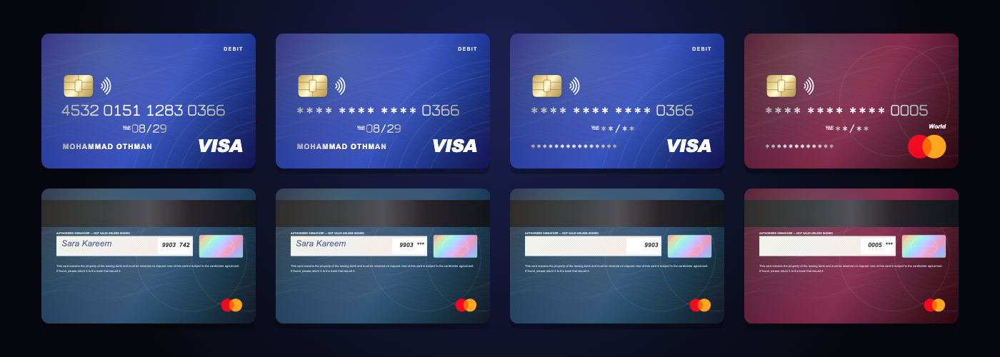
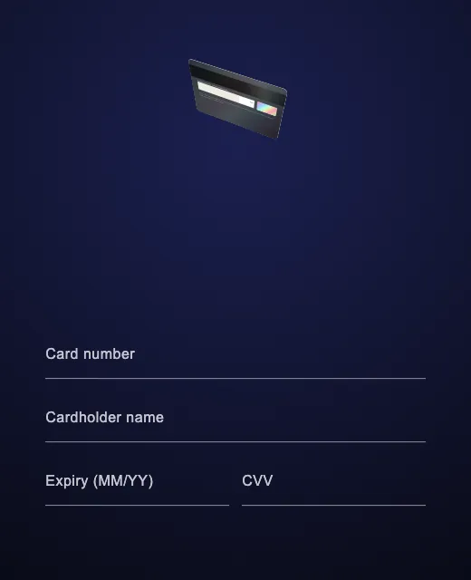
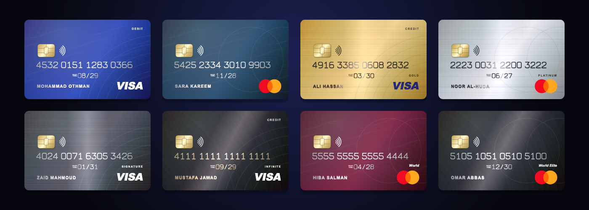
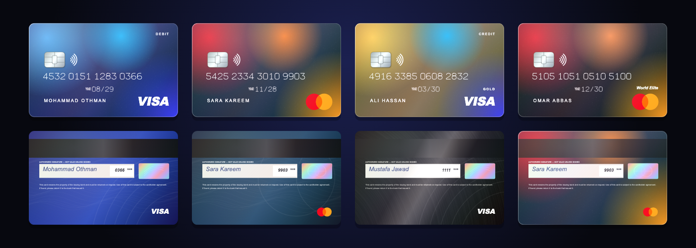

<p align="center">
  
</p>

<h1 align="center">bank_card_3d</h1>

<p align="center">
  <strong>Visa and Mastercard cards for Flutter, rendered in real 3D.</strong><br>
  Drag them, flick them, flip them. Photoreal metal or frosted glass, every tier,<br>
  a wallet stack, a live entry form — straight from whatever JSON your backend sends.
</p>

<p align="center">
  <a href="https://pub.dev/packages/bank_card_3d"></a>
  <a href="https://abojawdat.github.io/bank_card_ui/"></a>
  
  
  <a href="LICENSE"></a>
</p>

<p align="center">
  
</p>

<p align="center"><em>Not a video, not an image asset. Every frame above is painted by the package at run time.</em></p>

<p align="center">
  <a href="https://abojawdat.github.io/bank_card_ui/"><strong>▶ Try the live demo</strong></a>
</p>

---

## What you get

- **Real 3D** — perspective, a card edge with thickness, a floor shadow, spring physics. Drag to tilt, flick to spin, double-tap to flip. On desktop and web the card leans toward the mouse; on phones, hand it the gyroscope.
- **A minting animation** — the card flies in, the chip drops into place, every digit is stamped one by one, the logo pops and a light sweeps across.
- **Every tier, in its own material** — Visa Classic, Gold, Platinum, Signature, Infinite; Mastercard Standard, Gold, Platinum, World, World Elite. Plastic, brushed foil and spun black metal, each catching light as it turns.
- **Two looks** — `CardLook.photoreal` (embossed digits, EMV chip, magstripe, hologram) and `CardLook.glass` (frosted glass over drifting light).
- **Reads your API** — `BankCard.tryFromJson` understands `card_number`, `pan`, `masked_pan`, Stripe's `{brand, last4, exp_month}`, nested `card` objects, `08/29`, `2029-08`, Arabic digits…
- **Null-safe display** — anything the backend didn't send is drawn as `*` stars, so a record with only `last4` still looks like a whole card.
- **You choose what shows** — full number, last 4, masked or hidden; holder, expiry and CVV shown, masked or hidden; chip, contactless, tier and DEBIT/CREDIT labels on or off.
- **Wallet stack** — many cards stacked like a phone wallet; they deal in, tap one to pull it out.
- **Live entry form** — the card fills in as the user types, the brand morphs in, the card flips over for the CVV. Luhn, length and expiry validation built in.
- **English and Arabic** — labels, validation messages, RTL, Eastern-Arabic digit input. Picked from the app locale.
- **Fast** — a card at rest is painted once and cached; each frame only moves the light over it.
- **Zero dependencies.** Flutter only, all six platforms.

---

## Install

```sh
flutter pub add bank_card_3d
```

```dart
import 'package:bank_card_3d/bank_card_3d.dart';
```

## Quick start

```dart
BankCard3D(
  card: BankCard(
    number: '4532 0151 1283 0366',
    holderName: 'Mohammad Othman',
    expiryMonth: 8,
    expiryYear: 2029,
    tier: CardTier.platinum,
  ),
)
```

That's all. The brand is detected from the number, the material from the tier. `BankCard3D` takes exactly `width × width / kCardAspectRatio` (ISO ID-1, 85.60 × 53.98 mm).

---

## Straight from your API

Backends spell cards a hundred ways. `tryFromJson` reads the common ones and returns `null` — never throws — when a record has no usable number or isn't Visa/Mastercard.

```dart
final cards = [
  for (final json in response['cards']) ?BankCard.tryFromJson(json),
];

BankCardWallet(cards: cards)
```

All of these work:

```dart
{'card_number': '4532015112830366', 'holder_name': 'Mohammad Othman', 'expiry': '08/29', 'scheme': 'VISA', 'product': 'Infinite'}
{'masked_pan': '542523******9903', 'cardholder_name': 'SARA KAREEM', 'exp_month': 11, 'exp_year': 2028, 'level': 'world_elite'}
{'card': {'brand': 'visa', 'last4': '4242', 'exp_month': 3, 'exp_year': 2030, 'funding': 'debit'}}   // Stripe
{'pan': '2223003122003222', 'name': 'Noor Al-Huda', 'expiry_date': '2027-06', 'network': 'MasterCard'}
{'last4': '0005', 'brand': 'mastercard'}                                                             // just last4
```

| Field | Keys it looks for |
| --- | --- |
| number | `number` `card_number` `pan` `masked_pan` `masked_number` `card_no` — or `last4` (+ `bin` / `first6`) |
| holder | `holder_name` `cardholder_name` `card_holder` `name_on_card` `holder` `name` |
| expiry | `expiry` `expiry_date` `exp` `expires` `valid_thru` — or `exp_month` + `exp_year` |
| brand | `brand` `scheme` `network` `card_brand` `type` — or detected from the number |
| tier | `tier` `level` `product` `category` |
| kind | `funding` `card_type` `kind` `type` |

`toJson()` writes it back as snake_case and **never includes the CVV**.

---

## Show only what you want

<p align="center">
  
</p>

```dart
BankCard3D(
  card: card,
  display: const CardDisplay(
    number: NumberDisplay.lastFour,   // full · lastFour · mask · hide
    holder: FieldDisplay.hide,        // show · mask · hide
    expiry: FieldDisplay.show,
    cvv: FieldDisplay.mask,
    chip: true,
    contactless: true,
    tierName: true,                   // PLATINUM, World Elite…
    kindName: false,                  // DEBIT, CREDIT, PREPAID
    mask: '*',                        // or '•'
  ),
)
```

Ready-made: `CardDisplay()` (last four, CVV masked — the default), `CardDisplay.private` (last four only, nothing personal), `CardDisplay.everything` (all in the clear — what the form uses).

**Missing data never breaks the card.** No holder name? No expiry? Only `last4`? Those spots are drawn as stars instead of leaving holes.

---

## Wallet

<p align="center">
  
</p>

```dart
BankCardWallet(
  cards: cards,
  onSelected: (index) => setState(() => picked = index),   // null when put back
)
```

Cards are dealt in one by one. Tap a card to pull it out — it becomes a full interactive `BankCard3D` — tap it again to put it back. One card? You just get the card.

## Entry form

<p align="center">
  
</p>

```dart
final form = GlobalKey<FormState>();
BankCard? card;

BankCardForm(
  formKey: form,
  onChanged: (c) => card = c,
)

FilledButton(
  onPressed: () {
    if (form.currentState!.validate()) save(card!);
  },
  child: const Text('Save card'),
)
```

Numbers group themselves as you type (Arabic digits welcome), the brand logo morphs in, expiry formats to `MM/YY`, focusing the CVV flips the card. Autofill hints are set, so the platform's saved cards work. Only Visa and Mastercard pass validation.

---

## Looks and tiers

<p align="center">
  
</p>
<p align="center">
  
</p>

| Tier | Visa | Mastercard | Material |
| --- | --- | --- | --- |
| `standard` | Classic | Standard | plastic |
| `gold` | Gold | Gold | brushed gold foil |
| `platinum` | Platinum | Platinum | brushed platinum |
| `signature` | Signature | — | brushed graphite |
| `infinite` | Infinite | — | black metal, champagne digits |
| `world` | — | World | plastic, wine |
| `worldElite` | — | World Elite | black metal |

Your own colours:

```dart
BankCard3D(card: card, skin: CardSkin.branded(const Color(0xFF00897B)))
BankCard3D(card: card, look: CardLook.glass)
```

## Gyroscope

The package stays dependency-free, so it takes the tilt as a stream (`x` and `y` in −1…1). With [`sensors_plus`](https://pub.dev/packages/sensors_plus):

```dart
Offset? rest;
final tilt = accelerometerEventStream().map((e) {
  final now = Offset(e.x, e.y);
  rest = Offset.lerp(rest ?? now, now, 0.02);   // slowly re-centres on how the phone is held
  final d = (now - rest!) / 3;
  return Offset(-d.dx, d.dy);
}).asBroadcastStream();

BankCard3D(card: card, tilt: tilt)
```

## Small pieces

```dart
BankCardView(card: card, width: 120)               // flat, no animation — for lists
BankCardView(card: card, side: CardSide.back)
CardBrandMark(brand: CardBrand.mastercard)         // just the logo
CardBrand.detect('5425 23')                        // CardBrand.mastercard, safe on every keystroke
BankCard(number: '4532 0151 1283 0367').numberIssue   // CardIssue.failedChecksum
```

## Arabic

Under an Arabic locale every label and validation message switches to Arabic. Force it either way with `labels: BankCardLabels.arabic` / `BankCardLabels.english`, or bring another language with `BankCardLabels.english.copyWith(...)`.

---

## Example app

[`example/`](example/lib/main.dart) has the showcase (every brand, tier and display option), a wallet built from a mixed API response, the entry form, an English/Arabic switch and the gyroscope hookup. It's the same app as the [live demo](https://abojawdat.github.io/bank_card_ui/).

```sh
cd example && flutter run
```

## How it's drawn

Everything is `CustomPainter` in millimetres on the real ID-1 card. The digits are a hand-drawn embossed typeface (no font files); the chip, hologram, guilloche and brushed-metal textures are paths and gradients. The 3D is `Matrix4` perspective with a stack of edge layers for the thickness. Once a card stops changing, its face is baked into an image, so a resting or floating card costs one image and a few gradients per frame.

## Releasing

Bump `version:` in `pubspec.yaml`, add a line to `CHANGELOG.md`, push to `main`. GitHub Actions tags `vX.Y.Z` and publishes to pub.dev; the live demo redeploys on every push to `main`.

## Trademarks

Visa and Mastercard names and marks belong to their owners. The package draws them only to show which network a card belongs to.

---

## بالعربية

<div dir="rtl">

**بطاقات فيزا وماستركارد ثلاثية الأبعاد لتطبيقات Flutter.**

اسحب البطاقة، ارمِها لتدور، أو انقر مرتين لقلبها. مظهر واقعي (أرقام بارزة، شريحة، شريط مغناطيسي، هولوغرام) أو مظهر زجاجي، بكل الفئات: كلاسيك، ذهبية، بلاتينية، سيغنتشر، إنفينت، وورلد، وورلد إيليت. بدون أي اعتماديات، على المنصات الست.

### التثبيت

```sh
flutter pub add bank_card_3d
```

### من الـ API مباشرة

`tryFromJson` تقرأ أغلب أشكال البيانات (`card_number` و `masked_pan` و `last4` و `exp_month` …) وتُرجع `null` بدل أن ترمي استثناء.

```dart
final cards = [for (final json in response['cards']) ?BankCard.tryFromJson(json)];
BankCardWallet(cards: cards)
```

### اختر ما يظهر

```dart
BankCard3D(
  card: card,
  display: const CardDisplay(
    number: NumberDisplay.lastFour, // آخر ٤ أرقام فقط
    holder: FieldDisplay.hide,      // إخفاء الاسم
    cvv: FieldDisplay.mask,         // رمز الأمان نجوم
  ),
)
```

أي معلومة لم يرسلها الخادم (الاسم، تاريخ الانتهاء…) تُرسم نجوماً `*` بدل أن تترك فراغاً.

### نموذج الإدخال

`BankCardForm` تملأ البطاقة أثناء الكتابة، وتكتشف نوعها، وتقلبها عند كتابة رمز الأمان، وتتحقق من الرقم (Luhn) والتاريخ. تقبل الأرقام العربية، والرسائل بالعربية تلقائياً تحت اللغة العربية.

[جرّب العرض الحي في المتصفح](https://abojawdat.github.io/bank_card_ui/)

</div>

---

## Author

Built by **Mohammad Othman (Abojawdat)** — [github.com/Abojawdat](https://github.com/Abojawdat). If it saved you a week of `CustomPainter`, a ⭐ is appreciated.

## Licence

MIT — see [LICENSE](LICENSE).
